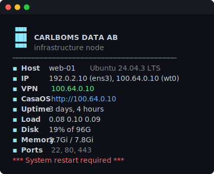
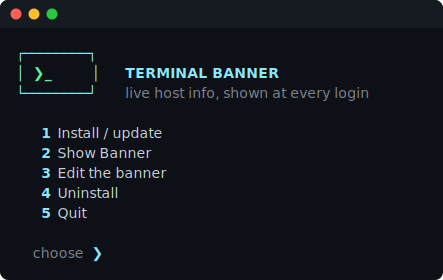

# terminal-banner

A colourful login banner (MOTD) for Linux — live host info at every SSH, console,
and terminal login. **One command, a menu, no flags.**

<p align="center">
  
</p>

## Install

```bash
curl -fsSL https://raw.githubusercontent.com/Carlboms-Data-AB/terminal-banner/main/setup.sh | sudo bash
```

It opens a menu — pick a number. Works on Raspberry Pi OS / Debian / Ubuntu /
Fedora / RHEL / Arch.

<p align="center">
  
</p>

After installing, reopen the menu on the host any time — no network:

```bash
sudo terminal-banner
```

## Edit the banner

The banner is the file **`/etc/terminal-banner/message`** on the host. Pick
**Edit the banner** in the menu, or edit it directly — the change shows at the
next login:

```bash
sudo nano /etc/terminal-banner/message
```

It's a template: plain text shows as-is, `{{TOKENS}}` fill in this host's live
values, and `{{COLOUR}}` tokens style it. A line whose token comes out empty is
hidden automatically (so the reboot line only shows when a reboot is pending).

**Preview a design first** (runs on Mac or Linux, no root, flags typos):

```bash
tools/preview.sh                     # previews ./message.txt
tools/preview.sh examples/server.txt
```

Colours: `{{RED}}` `{{GREEN}}` `{{YELLOW}}` `{{BLUE}}` `{{MAGENTA}}` `{{CYAN}}`
`{{WHITE}}` `{{BOLD}}` `{{DIM}}` `{{RESET}}` — emoji work too.

<details><summary><b>All tokens</b> (click to expand)</summary>

| Token | Value |
|-------|-------|
| `{{HOSTNAME}}` `{{FQDN}}` | short / fully-qualified name |
| `{{OS}}` `{{OS_ID}}` `{{KERNEL}}` `{{ARCH}}` `{{MODEL}}` | distro, kernel, arch, hardware |
| `{{DATE}}` `{{TIME}}` `{{TIMEZONE}}` `{{UPTIME}}` `{{BOOTED}}` | time / uptime |
| `{{CPU}}` `{{CORES}}` `{{LOAD1}}` `{{LOAD5}}` `{{LOAD15}}` | CPU, load |
| `{{CPU_TEMP}}` `{{THROTTLED}}` | temperature, Pi throttling (hidden when OK) |
| `{{MEMORY}}` `{{MEM}}` `{{MEM_FREE}}` `{{SWAP}}` | memory / swap (swap hidden when none) |
| `{{DISK}}` `{{DISK_FREE}}` `{{DISK_TOTAL}}` | root disk |
| `{{IP}}` `{{IP4}}` `{{IPV6}}` | all IPv4 / primary v4 / primary v6 |
| `{{VPNIP}}` | VPN/overlay IP (auto-detects NetBird `wt0`/`netbird` or `100.64/10`) |
| `{{IFACE}}` `{{GATEWAY}}` `{{DNS}}` `{{MAC}}` `{{PORTS}}` | route, DNS, MAC, listening ports |
| `{{DOCKER}}` `{{FAILED}}` | containers, failed units (hidden when none) |
| `{{USERS}}` `{{SESSIONS}}` `{{WHO}}` | logged-in users |
| `{{REBOOT}}` | red "restart required" when pending |
| `{{PUBIP}}` `{{UPDATES}}` | public IP / pending updates *(sync mode, or a cron — see below)* |
| `{{IP_<IFACE>}}` | that interface's IPv4, e.g. `{{IP_ETH0}}` |
| `{{URL_<IFACE>_PORT_<PORT>}}` | clickable URL, e.g. `{{URL_WT0_PORT_80}}` → `http://<wt0-ip>` (443→https, 80→http) |

`{{PUBIP}}`/`{{UPDATES}}` read a cached value. Sync mode refreshes it; in local
mode add a cron if you want them:
```bash
# /etc/cron.d/terminal-banner-cache
*/30 * * * * root sh -c 'curl -fs --max-time 4 https://api.ipify.org > /var/lib/terminal-banner/pubip'
```
</details>

Ready-made starting points live in [`examples/`](examples/):

| Example | Preview |
|---------|---------|
| [`server.txt`](examples/server.txt) — full system summary |  |
| [`branded.txt`](examples/branded.txt) — coloured header + link |  |
| [`ascii-art.txt`](examples/ascii-art.txt) — ASCII art + colour |  |

## Local or GitHub sync

- **Local (default):** the banner lives on each host and you edit it there —
  nothing is fetched after install.
- **Sync:** at the Install prompt, paste a raw `message.txt` URL (e.g.
  `https://raw.githubusercontent.com/USER/REPO/main/message.txt`). A timer pulls
  it every ~15 min, so you edit once in the repo and every synced host follows.
  Install again and press Enter to go back to local.

## Remove it

```bash
sudo terminal-banner-uninstall            # local, no network
```

## How it works & security

The banner renders **locally** at each login — via `/etc/update-motd.d` on
Debian/Ubuntu/RPi, and a shell snippet for desktop terminals. The renderer treats
the template as **data**: tokens are string-substituted, it's **never executed**
(no `eval`), and the ESC byte is stripped so escape sequences can't render. So a
banner — even one pulled by sync — can only change *text*, not run code, even
though it renders as root. In local mode nothing is fetched after install; in
sync mode only the template *text* is.

## Files

| File | Role |
|------|------|
| `setup.sh` | the menu-driven installer (renderer, default banner, and sync updater embedded) |
| `message.txt` | the default banner |
| `examples/` | ready-made templates |
| `tools/preview.sh` | preview a template with sample data |
| `tools/render-svg.py` | generate the README screenshots |

## License

[Apache-2.0](LICENSE) © Carlboms Data AB.
