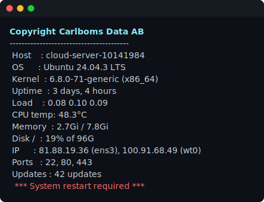
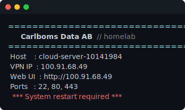
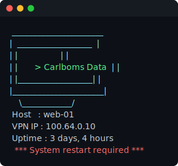

# terminal-welcome-message

A custom login banner (MOTD) for Linux hosts. Install it with one command; after
that it's **fully local** — the banner lives in `/etc/terminal-welcome/message`
on each host and you edit it **right on the box**. Nothing is fetched from GitHub
after setup. The renderer fills in **live, per-host values** (IP, uptime,
temperature, listening ports, reboot status …) at display time.

Shows on **SSH login**, **local console login**, and **desktop terminal windows**,
and reads a **local** file, so it always works — online or off.

<p align="center">
  
</p>

Ships with ready-to-use templates in [`examples/`](examples/) — copy one onto a
host's `/etc/terminal-welcome/message` to adopt it:

| Example | Preview |
|---------|---------|
| [`server.txt`](examples/server.txt) — full system summary |  |
| [`branded.txt`](examples/branded.txt) — coloured header + service link |  |
| [`ascii-art.txt`](examples/ascii-art.txt) — ASCII art + colour |  |
| [`minimal.txt`](examples/minimal.txt) — hostname + IP | — |
| [`plain.txt`](examples/plain.txt) — one static line | — |

## Install

**One command, a menu — no flags.** Run it in a terminal and pick an action.
Works on Raspberry Pi OS / Debian / Ubuntu / Fedora / RHEL / Arch:

```bash
curl -fsSL https://raw.githubusercontent.com/Carlboms-Data-AB/terminal-welcome-message/main/setup.sh | sudo bash
```

```
  Terminal Welcome Message
  ========================
   1) Install / update (local)
   2) Edit the banner
   3) Preview
   4) Uninstall
   5) Quit
```

After installing, reopen the same menu on the host with **no network**:

```bash
sudo terminal-welcome
```

The install bootstraps from GitHub, sets up the renderer and a local banner file,
then never contacts GitHub again. Re-running never overwrites a banner you've
edited on the host. (Piped with no terminal — e.g. CI/automation — it just
installs, no menu.)

## Editing the banner

Pick **Edit the banner** from the menu (`sudo terminal-welcome`) — or edit the
file directly. Either way it's the file **`/etc/terminal-welcome/message` on the
host**, and the change shows at the next login (instant, no sync, no GitHub):

```bash
sudo nano /etc/terminal-welcome/message       # edit on the box
sudo /usr/local/sbin/terminal-welcome-render  # preview the result immediately
```

It's a template: static text is shown as-is; `{{TOKENS}}` are replaced with this
host's live values. **A line is omitted only when a token in it resolves to
empty** — so the reboot line only appears when a reboot is pending, the swap line
only when swap exists, etc. Static lines with no token (e.g. a `Section:` header)
are always kept.

**Preview a template before you deploy it** with the bundled tool (runs anywhere
— Mac or Linux, no root — using sample data, and flags typos):

```bash
tools/preview.sh                 # preview ./message.txt
tools/preview.sh examples/server.txt
```

To change the **default** that fresh installs start with, edit
[`message.txt`](message.txt) in the repo (it's the banner baked into `setup.sh`).
Existing hosts are independent — re-running the installer never overwrites a
banner you've edited locally.

### Token catalogue

<details open><summary><b>System</b></summary>

| Token | Value |
|-------|-------|
| `{{HOSTNAME}}` | short hostname |
| `{{FQDN}}` | fully-qualified name (no DNS lookup) |
| `{{OS}}` | distro name + version (e.g. `Ubuntu 24.04.3 LTS`) |
| `{{OS_ID}}` | distro id (`debian`, `fedora`, `arch`, …) |
| `{{KERNEL}}` | kernel release |
| `{{ARCH}}` | CPU architecture (`x86_64`, `aarch64`) |
| `{{MODEL}}` | hardware model (Raspberry Pi model / DMI product) |
</details>

<details><summary><b>Time</b></summary>

| Token | Value |
|-------|-------|
| `{{DATE}}` | `YYYY-MM-DD HH:MM` |
| `{{TIME}}` | `HH:MM` |
| `{{TIMEZONE}}` | IANA timezone |
| `{{UPTIME}}` | pretty uptime |
| `{{BOOTED}}` | boot timestamp |
</details>

<details><summary><b>CPU</b></summary>

| Token | Value |
|-------|-------|
| `{{CPU}}` | CPU / SoC model |
| `{{CORES}}` | logical CPU count |
| `{{LOAD}}` / `{{LOAD1}}` | 1-minute load average |
| `{{LOAD5}}` / `{{LOAD15}}` | 5- / 15-minute load |
| `{{CPU_TEMP}}` | CPU temperature |
| `{{THROTTLED}}` | Raspberry Pi throttling state (yellow, hidden when OK) |
</details>

<details><summary><b>Memory & disk</b></summary>

| Token | Value |
|-------|-------|
| `{{MEMORY}}` | memory used, `%` |
| `{{MEM}}` | used / total (e.g. `2.7Gi / 7.8Gi`) |
| `{{MEM_FREE}}` | available memory |
| `{{SWAP}}` | swap used / total (hidden when no swap) |
| `{{DISK}}` | root usage (e.g. `19% of 96G`) |
| `{{DISK_FREE}}` / `{{DISK_TOTAL}}` | free / total on `/` |
</details>

<details><summary><b>Network</b></summary>

| Token | Value |
|-------|-------|
| `{{IP}}` | all global IPv4 with interface |
| `{{IP4}}` | primary IPv4 (default route) |
| `{{IPV6}}` | primary global IPv6 |
| `{{VPNIP}}` | VPN/overlay address (auto-detects NetBird `wt0`/`netbird` or `100.64.0.0/10`) |
| `{{IFACE}}` | default-route interface |
| `{{GATEWAY}}` | default gateway |
| `{{DNS}}` | resolvers |
| `{{MAC}}` | MAC of the default interface |
| `{{PORTS}}` | listening TCP ports reachable off-box |
</details>

<details><summary><b>Services, sessions & status</b></summary>

| Token | Value |
|-------|-------|
| `{{DOCKER}}` | running container count + names (docker/podman) |
| `{{FAILED}}` | failed systemd units (yellow, hidden when none) |
| `{{USERS}}` / `{{SESSIONS}}` | logged-in users / active sessions |
| `{{WHO}}` | list of logged-in users |
| `{{REBOOT}}` | `*** System restart required ***` in red when pending |
| `{{PUBIP}}` | public IP — *cached*; needs the optional refresh cron (below) |
| `{{UPDATES}}` | pending package updates — *cached*; needs the optional refresh cron (below) |
</details>

> **`{{PUBIP}}` and `{{UPDATES}}` are opt-in.** They read a value cached on disk
> that the local install doesn't populate on its own (that was the old sync job).
> If you use them, refresh the cache from cron — purely local, no GitHub. E.g.
> every 30 min write the public IP:
>
> ```bash
> # /etc/cron.d/terminal-welcome-cache
> */30 * * * * root sh -c 'curl -fs --max-time 4 https://api.ipify.org > /var/lib/terminal-welcome/pubip'
> ```
>
> (write a count to `/var/lib/terminal-welcome/updates` the same way if you use `{{UPDATES}}`.)

<details><summary><b>Generic (build your own)</b></summary>

Parameterised tokens resolved from whatever you write — no hardcoded apps:

| Token | Value |
|-------|-------|
| `{{IP_<IFACE>}}` | that interface's IPv4, e.g. `{{IP_ETH0}}`, `{{IP_WG0}}` |
| `{{URL_<IFACE>_PORT_<PORT>}}` | clickable URL to a service on that interface — e.g. `{{URL_WG0_PORT_80}}` → `http://<wg0-ip>`, `{{URL_ETH0_PORT_443}}` → `https://<eth0-ip>` (port 443 → `https`, 80 → `http`, else `http://ip:port`) |

Example: a CasaOS dashboard reachable over your NetBird interface is just
`{{URL_WT0_PORT_80}}`.

Interface names in these tokens must be letters/digits only (`ETH0`, `WG0`,
`WT0`) — matched case-insensitively; dotted/hyphenated names (e.g. `eth0.100`)
aren't supported.
</details>

### Colour & styling

Wrap text in colour tokens; `{{RESET}}` returns to default (auto-appended at the
end). Colours are applied **locally** after sanitising, so they never travel from
GitHub. Emoji work too (they're UTF-8).

`{{RED}}` `{{GREEN}}` `{{YELLOW}}` `{{BLUE}}` `{{MAGENTA}}` `{{CYAN}}` `{{WHITE}}` `{{BOLD}}` `{{DIM}}` `{{RESET}}`

## How it works

- **Login (Debian/Ubuntu/RPi OS).** The banner is rendered fresh at each login by
  `/etc/update-motd.d/00-welcome`, so values are always current; the stock
  banner/ad scripts are disabled so ours replaces them.
- **Login (Fedora/RHEL/Arch, no `update-motd.d`).** The banner is rendered onto
  `/etc/motd` at install (a point-in-time snapshot); live values still show in
  interactive terminals via the shell snippet below.
- **Desktop terminal windows** (non-login shells `pam_motd` never covers) render
  live via a guarded `/etc/profile.d` snippet.
- **No background sync.** After install nothing is fetched or scheduled — the
  banner is a local file (`/etc/terminal-welcome/message`) that you own and edit.

## Security

After install nothing is fetched from GitHub, so there's no ongoing supply-chain
surface — the banner is a local file. The renderer treats that file as **data**:
tokens are string-substituted, the template is **never executed** (no `eval`), and
the ESC control byte is stripped so ANSI/OSC escape sequences can't render. So
even a banner edited by an untrusted user can only change text — not run code,
even though the render runs as root at login.

## Making it your own (forking)

The engine is generic. To run your own copy:

- Fork the repo (so your hosts bootstrap `setup.sh` from your URL), then edit the
  default [`message.txt`](message.txt) to taste.
- Everything installed uses neutral names (`terminal-welcome-*`, `00-welcome`), so
  nothing is tied to this org except the default `message.txt` text and the
  example branding.
- The default `message.txt` assumes a **NetBird `wt0`** interface and a **CasaOS**
  dashboard (the `VPN IP` and `CasaOS` lines auto-hide where those are absent —
  swap in your own `{{IP_<IFACE>}}` / `{{URL_<IFACE>_PORT_<PORT>}}`).
- Preview edits anywhere with `tools/preview.sh path/to/message.txt`. Since each
  host is independent, you can also just edit `/etc/terminal-welcome/message` on
  one box to try something before rolling it into the default.

## Known edge cases

- **`Last login:` line.** On SSH, `sshd` prints `Last login: …` above the banner
  (it's separate from the MOTD). Suppress per-user with `touch ~/.hushlogin`, or
  globally with `PrintLastLog no` in `/etc/ssh/sshd_config`.
- **Updating the engine.** Editing a host's `/etc/terminal-welcome/message` is
  instant. Getting a newer *renderer* (new tokens, `setup.sh` fixes) means
  re-running the installer on each host — it's idempotent and won't touch your
  edited banner.
- **Desktop terminals** are covered for `bash` only; shells inside `tmux`/`screen`
  don't repeat the banner, and `sudo -s` inside SSH can print it twice.
- **Minimal installs** (Fedora/Arch without `iproute2`/`procps`) leave some tokens
  blank; the installer warns which tools are missing.

## Files

| File | Role |
|------|------|
| `setup.sh` | installer / uninstaller; embeds the renderer, the default banner, and the shell snippet |
| `message.txt` | the **default** banner baked into `setup.sh` (hosts edit their own local copy) |
| `examples/` | ready-to-use templates |
| `tools/preview.sh` | render a template with sample data (preview before deploying) |
| `tools/render-svg.py` | generate the README screenshots from a template |
